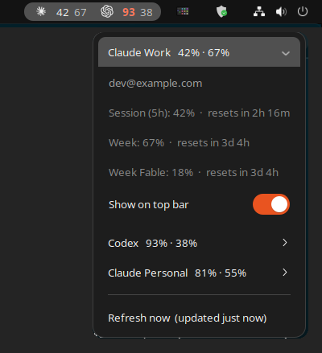

# gnome-ai-usage

Claude Code and Codex CLI usage limits on the GNOME top bar: the 5-hour session and the weekly limit, in percent,
for every account you are logged into.




- One group per account on the top bar: 5-hour % (bright) and weekly % (dim). Yellow at 75 %, red at 90 %.
- The menu shows every limit the API reports (including per-model weekly caps and extra usage) with time to reset.
- "Show on top bar" picks which accounts sit on the bar. By default it shows the first Claude and the first Codex account.
- Data refreshes every 5 minutes. "Refresh now" updates it immediately.

## Install (Ubuntu / Debian, GNOME 45+)

```sh
wget https://github.com/MarekBartczak/gnome-ai-usage/releases/latest/download/gnome-ai-usage.deb
sudo apt install ./gnome-ai-usage.deb
ai-usage setup
```

`ai-usage setup` (run as your normal user, not root):

1. finds logged-in CLIs in `~/.claude`, `~/.claude-*`, `~/.codex`, `~/.codex-*` (plus `$CLAUDE_CONFIG_DIR` / `$CODEX_HOME`),
2. enables the `ai-usage-probe.timer` systemd user timer,
3. enables the GNOME extension,
4. remembers where `claude` / `codex` live (the timer runs with a minimal `PATH`, e.g. without nvm).

On first install GNOME Shell does not see the new extension until you **log out and back in**
(on X11, Alt+F2 → `r` is enough). After that, run `gnome-extensions enable ai-usage@marekbartczak.github.io`
or `ai-usage setup` again.

Requirements: Claude Code logged in with a Claude.ai subscription (Pro/Max/Team) and/or Codex CLI logged in
with ChatGPT. API-key logins have no subscription limits to show.

## How it works

`ai-usage probe` reads the OAuth access token the CLI already stored and calls the same usage endpoints the CLIs use
for `/usage` and `/status`. The result goes to `~/.local/share/ai-usage-module/status.json`. The extension watches that file.

| Provider | Token | Endpoint |
|---|---|---|
| Claude Code | `<config dir>/.credentials.json` | `GET https://api.anthropic.com/api/oauth/usage` |
| Codex CLI | `<config dir>/auth.json` | `GET https://chatgpt.com/backend-api/wham/usage` |

- Tokens never leave your machine except in requests to those two endpoints.
- `ai-usage` never refreshes tokens itself. Refresh tokens rotate, so refreshing from outside would log your CLI out.
  Instead, when a token is about to expire (Claude access tokens last ~8 h, e.g. overnight), it runs the CLI once
  with a one-word prompt (`claude -p` on Haiku, `codex exec`), and the CLI refreshes its own token. That costs a
  negligible amount of usage, runs at most once per 30 minutes per account, and can be turned off with
  `ai-usage probe --no-wake` in the service.
- If that fails (e.g. the refresh token itself expired after weeks without use), the last known numbers stay on
  the bar, dimmed and marked stale, until you log in again.
- **Both endpoints are undocumented** and may change or disappear without notice.

## Commands

```sh
ai-usage setup                                   # auto-detect and link, enable timer + extension
ai-usage profile link claude work ~/.claude-work --label "Claude Work"
ai-usage profile list
ai-usage profile remove claude-work
ai-usage probe                                   # fetch now
ai-usage status                                  # table; --json for raw status.json
```

Change the interval with `ai-usage setup --interval 2min`. Going below ~2 minutes risks HTTP 429 from the Claude endpoint.

## Uninstall

```sh
systemctl --user disable --now ai-usage-probe.timer
gnome-extensions disable ai-usage@marekbartczak.github.io
sudo apt remove gnome-ai-usage
rm -rf ~/.local/share/ai-usage-module
```

## Development

```sh
python3 -m venv .venv && .venv/bin/pip install -e . pytest
.venv/bin/pytest
for t in tests/gnome/*.js; do gjs -m "$t"; done
./scripts/install-gnome-extension-local.sh      # copy extension to ~/.local/share/gnome-shell/extensions
./packaging/build-deb.sh                        # dist/gnome-ai-usage_<version>_all.deb
```

Releases: push a `v*` tag and GitHub Actions builds the `.deb` and attaches it to the release.

## License

MIT. Not affiliated with Anthropic or OpenAI.
